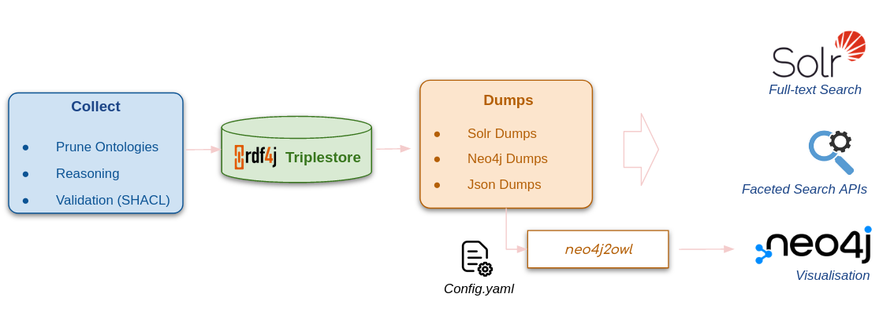

# OBASK Architecture

OBASK pipeline comprises three servers/services and four data pipelines:

- Pipeline _servers_:
  - Triplestore
  - Solr + preconfigured Solr core
  - Search API (`ontology-search`)
  - Neo4J production instance (`obask-kb`)
- Pipeline _data pipelines_:
  - Data collection (`pipeline-collectdata`)
  - Triplestore ingestion (`pipeline-updatetriplestore`)
  - Data transformation and dumps for production instances (`pipeline-dumps`)
  - KG production instance ingestion (`pipeline-updateprod`)

Server and data pipelines are combined into 3 general sub-pipelines which are configured as Docker compose services. This documentation describes all 3 sub-pipelines in detail, including which role the individual servers and data pipelines play.

## Sub-pipeline: Deploy triplestore

- _Summary_: This pipeline deploys an empty triplestore, collects all relevant ontologies, and pre-processes and loads the collected data into the triplestore. Components:
  - Triplestore
  - `pipeline-collectdata` (data collection and preprocessing pipeline for all resources)
  - `pipeline-updatetriplestore` (loading collected data into the triplestore)
- _Dependents_: `pipeline-dumps`

### Service: Triplestore

- _Image_: [eclipse/rdf4j-workbench:3.7.7](https://hub.docker.com/layers/eclipse/rdf4j-workbench/3.7.7/images/sha256-9159994bed66044562524e0e65d6add466af54e37cd1f554db8a2d8d22cfbcbf?context=explore)
- _Summary_: The triplestore is currently an unspectacular default implementation of rdf4j-server. We make use of a simple in-memory store that is configured [here](https://github.com/OBASKTools/obask/blob/main/config/updatetriplestore/rdf4j.txt). The container is maintained elsewhere (see docker-hub pages of image for details).

### Data pipeline: pipeline-collectdata

- _Image_: [ghcr.io/obasktools/pipeline-collectdata](https://github.com/OBASKTools/pipeline-collectdata/pkgs/container/)pipeline-collectdata
- _Git_: https://github.com/OBASKTools/pipeline-collectdata
- [Dockerfile](https://github.com/OBASKTools/pipeline-collectdata/blob/master/Dockerfile)
- _Summary_: This container encapsulates a process that downloads a number of source ontologies, and applies a number of ROBOT-based pre-processing steps, in particular: extracting modules/slices of external ontologies, running consistency checks and serialising as ttl for quicker ingest into triplestore. It also contains the _data embargo_ pipeline and has some provisions for _shacl validation_.

#### Detailed notes on pipeline-collectdata

- The process is encoded [here](https://github.com/OBASKTools/pipeline-collectdata/blob/master/process.sh). It performs the following steps:
  1. Downloading external ontologies.
  1. Removing embargoed data. The technique applied here is based on using ROBOT query and encoding the embargo logic as SPARQL queries (combined with `ROBOT remove`).
  1. Ontologies in [project configuration](https://github.com/OBASKTools/obask/blob/main/config/collectdata/vfb_fullontologies.txt) are imported in their entirety.
  1. Ontologies in [slice configuration](https://github.com/OBASKTools/obask/blob/main/config/collectdata/vfb_slices.txt) are sliced. The slice corresponds to a BOTTOM module that has the combined signature of all ontologies in the fullontologies section with the signature of the KB.
  1. All ontologies are converted to turtle format.
  1. All ontologies ready to be imported into the triplestore are gzipped.

### Data pipeline: pipeline-updatetriplestore

- _Image_: [ghcr.io/obasktools/pipeline-updatetriplestore](https://github.com/OBASKTools/pipeline-updatetriplestore/pkgs/container/pipeline-updatetriplestore)
- [Dockerfile](https://github.com/OBASKTools/pipeline-updatetriplestore/blob/master/Dockerfile)
- _Git_: https://github.com/OBASKTools/pipeline-updatetriplestore
- _Summary_: This container encapsulates a process that (1) sets up the triplestores and (2) loads all of the ttl files generated by pipeline-collectdata into the triplestore. The image contains the configuration details of triplestore, like choice of triplestore engine.

#### Detailed notes on pipeline-updatetriplestore:

- The [process](https://github.com/OBASKTools/pipeline-updatetriplestore/blob/master/process.sh) loads the ontologies and data collected in the previous step into the triple store.

## Sub-pipeline: Data transformation and dumps for production instances (pipeline-dumps)

- _Summary_: This pipeline transforms the knowledge graph in the triplestore into various custom data dumps used by downstream services such as the production knowledge graph (neo4j) instance and solr.
- _Depends on_: Triplestore
- _Dependents_: obask-kb, solr, pipeline-updatesolr

### Data pipeline: pipeline-dumps

- _Image_: [ghcr.io/obasktools/pipeline-dumps](https://github.com/OBASKTools/pipeline-dumps/pkgs/container/pipeline-dumps)
- _Git_: https://github.com/OBASKTools/pipeline-dumps
- _Summary_: The dumps pipeline access the triple store to obtain data dumps that in mungs, transforms and enriches for various downstream purposes such as pipeline-prod ingestion and solr ingestion.
- [Dockerfile](https://github.com/OBASKTools/pipeline-dumps/blob/master/Dockerfile)

#### Detailed notes on pipeline-dumps

- The [process](https://github.com/OBASKTools/pipeline-dumps/blob/master/process.sh) performs the following steps (all encoded in the [Makefile](https://github.com/OBASKTools/pipeline-dumps/blob/master/dumps.Makefile)):
  1. Build dump for `obask-kb` (Neo4j tabular data structure)
  1. Build dump for `solr` (special json file, created using python)

## Sub-pipeline: Knowledge Graph (obask-kb)

- _Summary_: This pipeline deploys the production instance of the Knowledge Graph (neo4j database) and loads all the relevant data.
- _Depends on_: pipeline-dumps
- _Dependents_: None

### Service: obask-kb

- _Image_: [ghcr.io/obasktools/obask-kb](https://github.com/OBASKTools/obask-kb/pkgs/container/obask-kb)
- _Git_: https://github.com/OBASKTools/obask-kb
- [Dockerfile](https://github.com/OBASKTools/obask-kb/blob/main/Dockerfile)
- _Summary_: Deploys an empty, configured instance of a Neo4J database with the [neo2owl plugin](https://github.com/VirtualFlyBrain/neo4j2owl), APOC and GDS tools.

### Data pipeline: pipeline-updateprod

- _Image_: [ghcr.io/obasktools/pipeline-updateprod](https://github.com/OBASKTools/pipeline-updateprod/pkgs/container/pipeline-updateprod)
- _Git_: https://github.com/OBASKTools/pipeline-updateprod
- [Dockerfile](https://github.com/OBASKTools/pipeline-updateprod/blob/master/Dockerfile)
- _Summary_: The update-prod container currently takes an ontology (from the integration layer) and loads it into the the Neo4J instance (pipeline-prod) using the neo2owl plugin. Process:
  1. Loading the ontology using the `neo4j2owl:owl2Import()` procedure
  1. Setting a number of indices (see detailed notes below).

#### Detailed notes about pipeline-updateprod

- You can set additional Pipeline post-processing steps like indices by editing [this file](https://github.com/OBASKTools/obask/blob/main/config/update-prod/pdb_set_indices.neo4j). Note that this file can be used to set arbitrary post-processing cypher queries, not just indices (contrary to the file name). Essentially, all list cypher queries are executed in order right after PDB import is completed.
- The possible configuration settings for the `neo4j2owl:owl2Import()` procedure are described [here](https://github.com/VirtualFlyBrain/neo4j2owl#configuration-of-neo4j2owl). The configuration is stored [here](https://github.com/OBASKTools/obask/blob/main/config/prod/neo4j2owl-config.yaml).

## Sub-pipeline: Ontology Search (ontology-search)

- _Summary_: This pipeline deploys the production instance of the Knowledge Graph (neo4j database) and loads all the relevant data.
- _Depends on_: pipeline-dumps
- _Dependents_: None

### Service: Solr

- _Image_: [solr:8.11](https://hub.docker.com/layers/library/solr/8.11/images/sha256-50130507d75ae35de3511e04fb80e5939d868499e6c8608fe8f7664e956dc69b?context=explore)
- _Summary_: Deploys an empty, configured instance of Solr.

### Data pipeline: pipeline-updatesolr

- _Image_: [ghcr.io/obasktools/pipeline-updatesolr](https://github.com/OBASKTools/pipeline-updatesolr/pkgs/container/pipeline-updatesolr)
- _Git_: https://github.com/OBASKTools/pipeline-updatesolr
- [Dockerfile](https://github.com/OBASKTools/pipeline-updatesolr/blob/main/Dockerfile)
- _Summary_: The pipeline-updatesolr container initializes the Solr schema and indexes the json data generated by the pipeline-dumps to the Solr.

### Service: ontology-search

- _Image_: [ghcr.io/obasktools/ontology-search](https://github.com/OBASKTools/ontology-search/pkgs/container/ontology-search)
- _Git_: https://github.com/OBASKTools/ontology-search
- [Dockerfile](https://github.com/OBASKTools/ontology-search/blob/main/api/Dockerfile)
- _Summary_: Provides ontology search APIs.