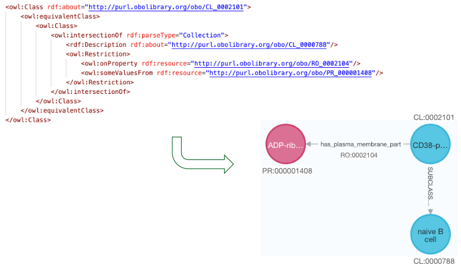

# OBASK Features

## **Transform Ontologies into Applications**
OBASK is packed with features designed to simplify the process of building search and knowledge exploration applications. Here's how OBASK empowers you to unlock the potential of your ontologies.

### **1. Ontology-Driven Application Creation**
- Build customized applications by simply defining input ontologies and providing classifications through configuration files.
- Automatically generate data exploration tools tailored to your domain.
- Automatically materialize knowledge graphs from your ontologies.

<p align="center">
  
</p>
*Figure: Materialise ontologies for property graph representations.*

---

### **2. Configuration-Based Setup**
- No programming skills required: Define your settings using simple configuration files.
- Flexible parameters to customize outputs for specific use cases.

#### Example Configuration File:

Input ontology file (owl, see [fullontologies.txt](https://github.com/OBASKTools/obask/blob/main/config/collectdata/vfb_fullontologies.txt))
```txt
http://purl.obolibrary.org/obo/cl.owl
https://purl.obolibrary.org/obo/go/extensions/go-plus.owl
http://purl.obolibrary.org/obo/uberon/uberon-base.owl
```

Gross classification file (yaml, see [neo4j2owl-config.yaml](https://github.com/OBASKTools/obask/blob/main/config/dumps/neo4j2owl-config.yaml)) 
```yaml
neo_node_labelling:
  - label: Cell
    classes:
      - CL:0000000
  - label: Nervous_system
    classes:
      - RO:0002131 some FBbt:00005093
      - FBbt:00005155
        
allow_entities_without_labels: true

curie_map:
  RO: http://purl.obolibrary.org/obo/RO_
  CL: http://purl.obolibrary.org/obo/CL_
  FBbt: http://purl.obolibrary.org/obo/fbbt#
```

---

### **3. Solr Index Creation and Search Endpoints**
- Generate ready-to-use Solr indexes for powerful search capabilities.
- Create robust search APIs automatically to query your data.
- Support for advanced search functionalities such as semantics tags based entity boosting/filtering to explore and analyze your data.

#### Key Benefits:
- Fast indexing for large datasets.
- Seamless integration with search-based applications.

---

### **4. Fast and Scalable**
- OBASK is optimized to handle large ontologies efficiently, ensuring fast setup and execution.
- Scalable for both small-scale projects and extensive datasets.

---

### **Explore the Potential of OBASK**
OBASK combines simplicity, flexibility, and power to help you build impactful knowledge-driven applications. Whether you’re working on research, data analysis, or application development, OBASK provides the tools you need to succeed.

