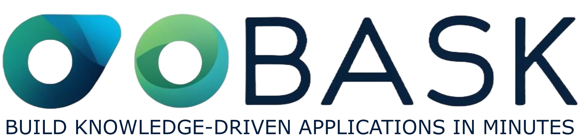
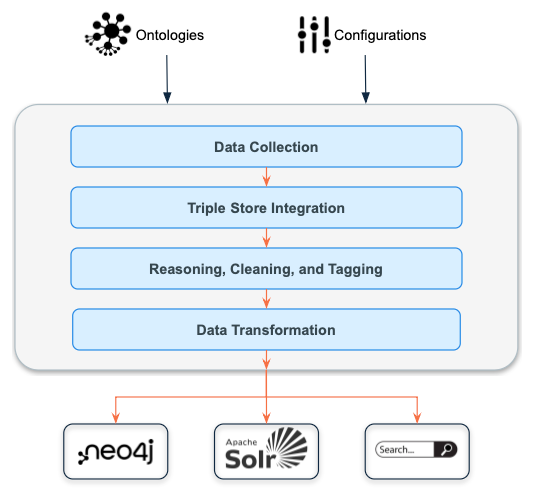

# Ontology Based Application Starter Kit (OBASK)

!!! info "Empower Your Ontologies"

    OBASK (Ontology-Based Application Starter Kit) enables users to create search
    and knowledge exploration applications effortlessly, without any programming 
    skills. With OBASK, you can transform your ontologies into powerful applications
    that unlock the full potential of your data.

### Why Choose OBASK?
- **No Coding Required**: Simplify complex processes and focus on your data.
- **Automatic Outputs**: Generate knowledge graphs, Solr indexes, and search endpoints with a single command.
- **Fast and Efficient**: Get started in minutes and deliver impactful results quickly.

### Key Features
- **Ontology-Driven**: Create applications by defining your input ontologies and classifications.
- **Search and Exploration**: Automatically build powerful search endpoints for data analysis.
- **Configurable**: Use simple configuration files to customize your application setup.

### Get Started Today
Ready to explore the power of OBASK?
- [Get Started](quick_start.md) to install and run OBASK in just a few steps.
- [Learn More](features.md) about how OBASK works and its innovative features.

  

*Figure: Input ontologies are processed by OBASK, generating knowledge graphs, Solr indexes, and search endpoints.*

